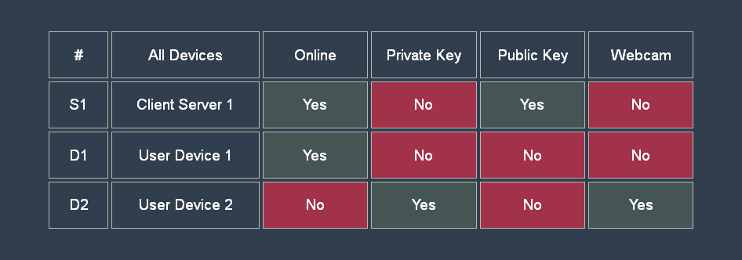
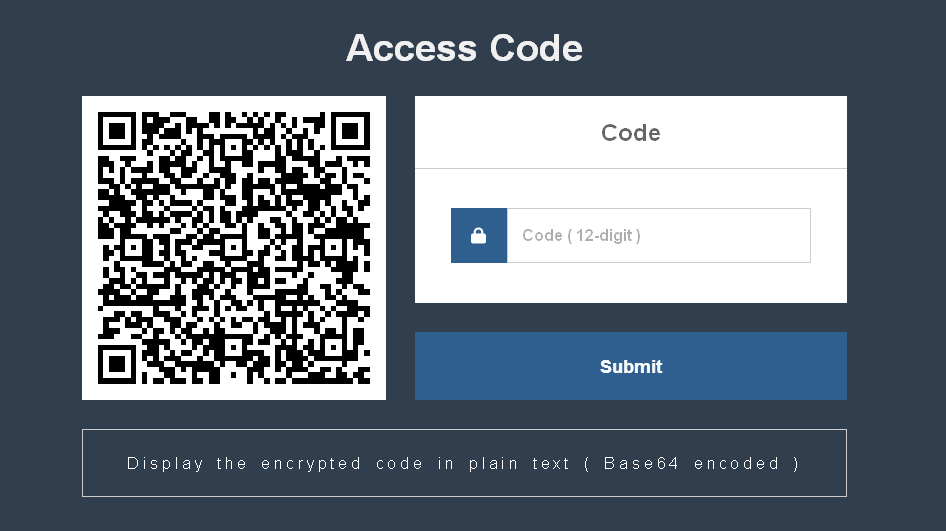
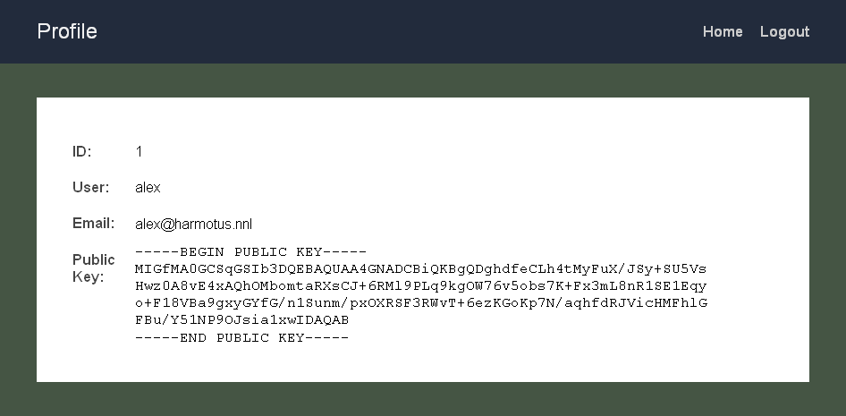

#Secure Login One

Private Keys : (&nbsp;**Never** on servers&nbsp;) and (&nbsp;**Never** on online devices&nbsp;)

## Requirements

## Description

**1&nbsp;)&nbsp;** Using an online device (&nbsp;D1&nbsp;) the user goes to the server's login page (&nbsp;S1&nbsp;)

**2&nbsp;)&nbsp;** The user simply enters his username in the form, and this data is submitted to the server (&nbsp;login.php&nbsp;)

**3&nbsp;)&nbsp;** If the user's username exists in the server's database (&nbsp;code.php&nbsp;) then the server creates a 12-digit random code, this random code is encrypted with the user's public key, and a QR code containing the encrypted random code is sent to the user (&nbsp;code.php&nbsp;)

**4&nbsp;)&nbsp;** Using an offline device (&nbsp;D2&nbsp;) the user scans the QR code, the QR code data is decrypted with the user's private key, and this decrypted data is submitted to the server (&nbsp;code.php&nbsp;)

**5&nbsp;)&nbsp;** If the 12-digit code submitted by the user is correct (&nbsp;test.php&nbsp;) then the user will be able to access the user's home page (&nbsp;home.php&nbsp;)

**6&nbsp;)&nbsp;** And the user will also be able to access the user's profile page (&nbsp;profile.php&nbsp;)

## Types of Philosophy

**&raquo; &nbsp;** Philosophy : **Never-Never**

* Private Keys : (&nbsp;**Never** on servers&nbsp;) and (&nbsp;**Never** on online devices&nbsp;)

* Therefore, public keys only on (&nbsp;online or offline&nbsp;) servers and private keys only on offline devices.

* This philosophy only applies when using asymmetric encryption algorithms (&nbsp;RSA, ECDSA, EdDSA, etc.&nbsp;)

**&raquo; &nbsp;** Philosophy : **Only-Only**

* Private Keys : (&nbsp;**Only** on offline servers&nbsp;) and (&nbsp;**Only** on offline devices&nbsp;)

* Therefore, private keys : never on online servers and never on online devices.

* This philosophy only applies when using symmetric encryption algorithms (&nbsp;AES, 3DES, etc.&nbsp;)
